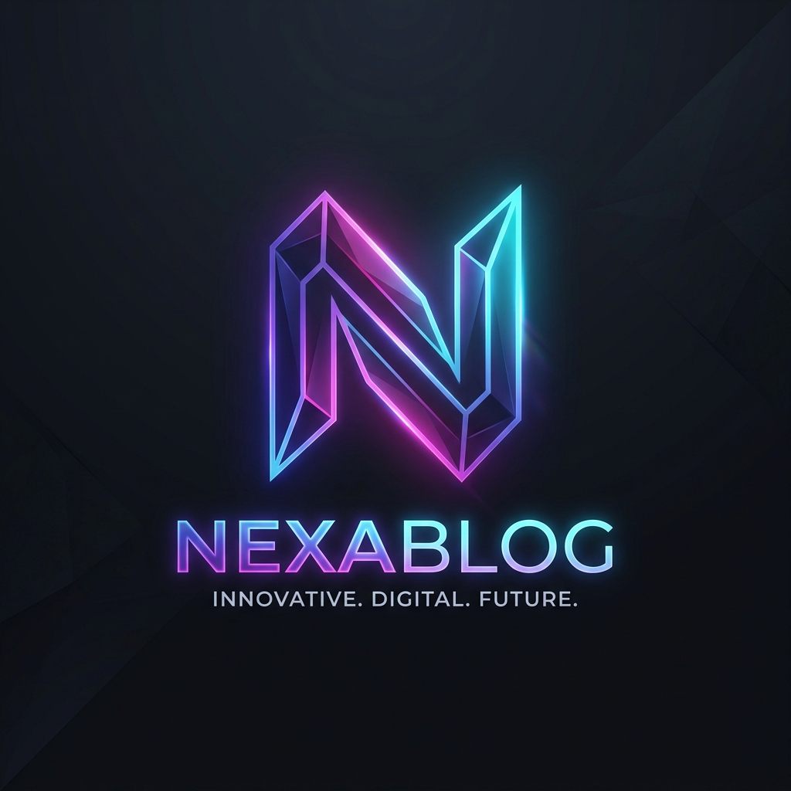
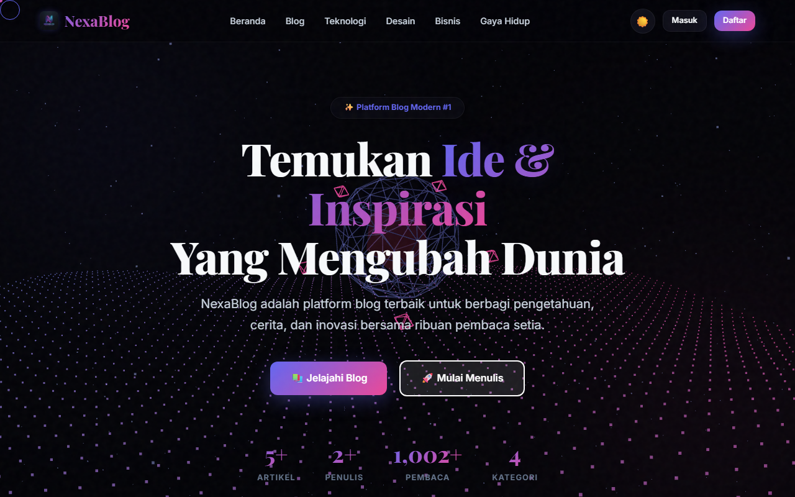
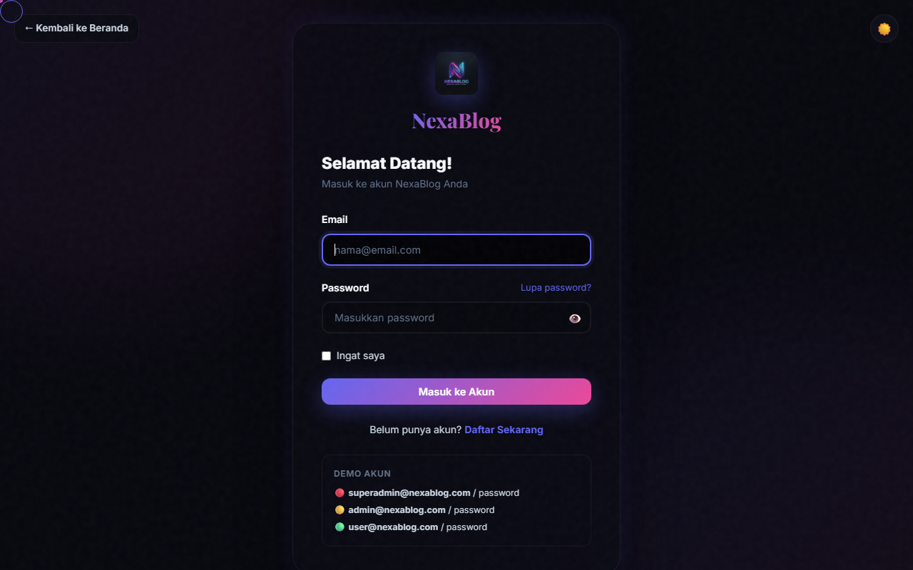
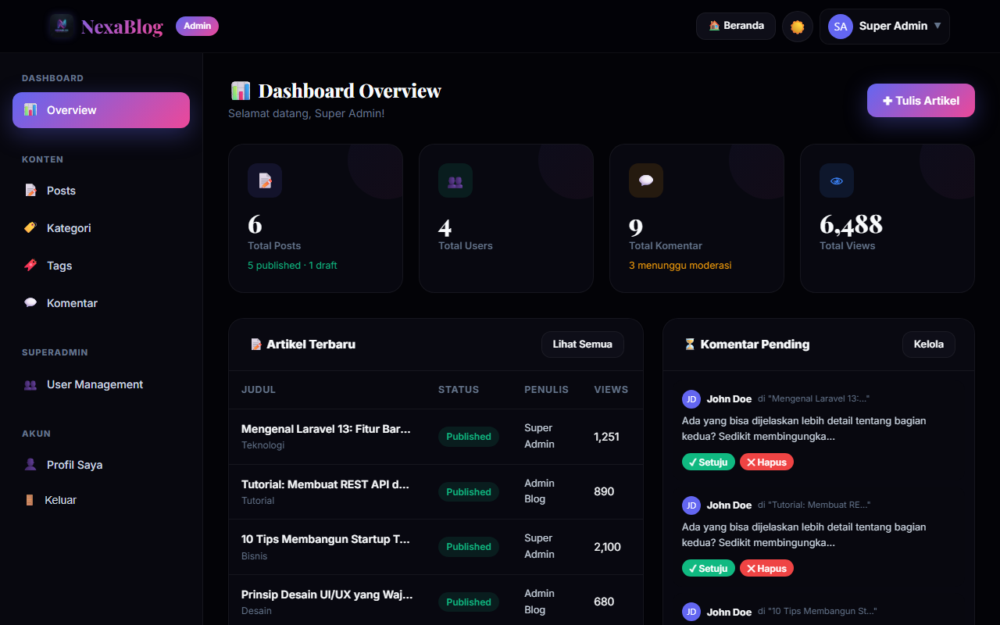

# NexaBlog — Premium Laravel 13 Web Blog



NexaBlog adalah platform web blog ultra-mewah (premium UI/UX) berbasis **Laravel 13** dan **Blade**, yang diperkaya dengan visual imersif **3D Scroll Animation** menggunakan **Three.js** dan **GSAP ScrollTrigger**, serta sistem pengguliran super halus **Lenis Kinetic Scroll**.

Aplikasi ini menyajikan visual modern bergaya glassmorphism sinematik dengan pendaran ambient background glow blobs dan transisi dark/light mode yang elegan.

---

## 🌟 Fitur Utama

- **3D Speed-Warp Scroll Animation**: Latar belakang grid partikel interaktif (Three.js) yang bereaksi dan terdistorsi memanjang secara dinamis sesuai kecepatan scroll pengguna (GSAP ScrollTrigger).
- **Butter-Smooth Scrolling**: Pengguliran halaman selembut sutra menggunakan Lenis Smooth Scroll untuk meluncur stabil secara linear.
- **Tekstur Sinematik & Custom Cursor**: Overlay grain/noise halus di atas layar dikombinasikan dengan kursor interaktif yang mengekor dengan efek pegas (*spring physics*).
- **Glassmorphism Design System**: Seluruh antarmuka kartu (dashboard, profil, detail blog, form autentikasi) didesain transparan dengan tingkat blur backdrop tinggi.
- **Multirole System**: Sistem otentikasi manual multirole:
  - 🔴 **Superadmin**: Kontrol penuh atas seluruh konten blog termasuk user management.
  - 🟡 **Admin**: Kontrol penuh CRUD blog (posting, kategori, tag, komentar), tidak bisa mengakses manajemen pengguna.
  - 🟢 **User**: Hak baca blog publik, mengedit info profil pribadi, dan mengirimkan komentar.
- **Notifikasi Toast Terpusat**: Pesan notifikasi sukses/gagal di pojok kanan atas dengan animasi auto-dismiss 5 detik (kecuali halaman auth).
- **Copy Code Button**: Penyisipan otomatis tombol "Salin" di pojok kanan atas setiap blok kode pemrograman (`pre`) dengan feedback visual sukses instan.

---

## 📸 Preview UI/UX Sistem

Berikut adalah tangkapan layar antarmuka premium NexaBlog:

| Halaman | Tangkapan Layar |
|---|---|
| **Identity Logo** |  |
| **Landing Page 3D Hero** |  |
| **Halaman Login Glassmorphism** |  |
| **Admin Dashboard Overview** |  |

---

## 🛠️ Persyaratan Sistem

Pastikan komputer Anda memenuhi persyaratan berikut sebelum memulai instalasi:

- **PHP** >= 8.3 (Laravel 13 default)
- **Composer** (Dependency Manager)
- **SQLite** / **MySQL** (Default database SQLite menggunakan file `.sqlite` local)
- Koneksi internet untuk memuat pustaka CDN (Three.js, GSAP, Lenis)

---

## 🚀 Langkah Instalasi

Ikuti langkah-langkah di bawah ini untuk menjalankan NexaBlog di lokal server Anda:

### 1. Clone Repository
```bash
git clone https://github.com/username/nexablog.git
cd nexablog
```

### 2. Install Dependensi PHP
```bash
composer install
```

### 3. Setup Environment File
Salin file `.env.example` menjadi `.env`:
```bash
copy .env.example .env
```
Secara default, Laravel 13 menggunakan database **SQLite**. Anda tidak perlu melakukan konfigurasi database tambahan jika menggunakan SQLite. Sistem akan otomatis membuat file `database/database.sqlite`.

Jika ingin menggunakan **MySQL**, silakan sesuaikan parameter `DB_CONNECTION`, `DB_HOST`, `DB_PORT`, `DB_DATABASE`, `DB_USERNAME`, dan `DB_PASSWORD` di file `.env`.

### 4. Buat Application Key
```bash
php artisan key:generate
```

### 5. Jalankan Migrasi & Database Seeding
Jalankan perintah berikut untuk membuat tabel database dan mengisi data demo awal (kategori, tag, postingan, dan akun pengguna):
```bash
php artisan migrate:fresh --seed
```

### 6. Hubungkan Storage Link
Buat simbolis link folder storage agar gambar postingan/avatar dapat diakses secara publik:
```bash
php artisan storage:link
```

### 7. Jalankan Development Server
```bash
php artisan serve
```
Buka peramban (browser) Anda dan akses alamat: **`http://127.0.0.1:8000`**

---

## 🔑 Akun Demo Pengguna

Berikut adalah daftar kredensial akun yang siap digunakan untuk menguji fungsionalitas multirole:

| Role | Email | Password | Hak Akses |
|---|---|---|---|
| 🔴 **Superadmin** | `superadmin@nexablog.com` | `password` | CRUD Lengkap + Manajemen User |
| 🟡 **Admin** | `admin@nexablog.com` | `password` | CRUD Blog (Posts, Categories, Tags, Comments) |
| 🟢 **User** | `user@nexablog.com` | `password` | Hanya baca, kelola profil diri, & komentar |

---

## 📁 Struktur Berkas Penting UI/UX

- **[three-scene.js](public/js/three-scene.js)**: Mesin animasi 3D scroll ( Three.js & GSAP ScrollTrigger).
- **[app.js](public/js/app.js)**: Logika custom cursor trail dan utilitas salin kode.
- **[app.css](public/css/app.css)**: CSS kustom desain system (variabel tema light/dark, glassmorphism, progress bar, shining hover).
- **[app.blade.php](resources/views/layouts/app.blade.php)**: Layout utama situs blog publik.
- **[auth.blade.php](resources/views/layouts/auth.blade.php)**: Layout khusus halaman autentikasi (login, register).
- **[admin.blade.php](resources/views/layouts/admin.blade.php)**: Layout area admin panel.
